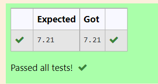

# DISTANCE-BETWEEN-TWO-POINTS

## AIM:
To write a python program to find the distance two 2 points
## ALGORITHM:
### Step 1: 
import the math module
### Step 2: 
enter the values in a list in two variables
### Step 3: 
Substitute the values in the distance formula  
### Step 4: 
Store the answer of the substitution in variable
### Step 5: 
Print the variable which stored answer
### PROGRAM:
  ```
 #Program to find the distance between two points.
#Developed by: S.M.SYED MOKTHIYAR
#RegisterNumber:22006227
import math
a=[10,6]
b=[4,2]
dis=math.sqrt((b[0]-a[0])**2+(b[1]-a[1])**2)
print("{:.2f}".format(dis))

```
### OUTPUT:



### RESULT:
Thus the experiment executed sucessfully
